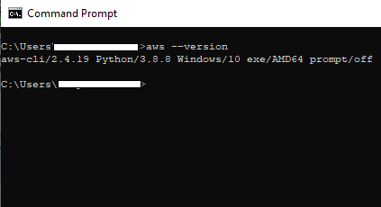

# Hosting a static website on S3 bucket

## Introduction
AWS S3 is great place to host a static website.If you want the DNS domain of your choice then use [Amazon Route 53](https://aws.amazon.com/route53/) service.I will discuss about Amazon Route 53 in another tutorial.In this tutorial my personal website page is going to have DNS domain name in the the following format. 
NAME_OF_THE_WEBSITE.s3.AWS_REGION.amazonaws.com/index.html

## Best Practice
It is a efficient practice to create AWS resources using AWS CLI(Commmand Line Interface).You will need to install AWs CLI on your local computer.The administrator of the account should create a new user with the necessary permission and provide the user with <b>Access key Id,Secret Access key</b>. 
Maintaining you source code in version control repository is great when you are working in a team and also useful to track your changes and history.

## Intial Setup
To make sure that AWS CLI is installed on the local machine enter the following command on Command prompt `aws --version`.Please note my local computer operating system is Windows 10.The commands could differ for Mac or Linux. 
 

 
Now we need to enter `aws configure` command 
- User will prompted to enter the Access key Id and Secret Access key which you can copy paste.Access key Id and Secret - Access key is important for information which you should keep in safe and secure place and should not be shared.
- Enter the region where you want to deploy the AWS resourse.For example ap-southeast-2 which is the Sydney region.
- format for output.Enter json in the prompt. 
Please find screen shot below 

 After entering all the information above the prompt is retured.Note that prompt does not display any message that login sucessful.So to test it we need to enter the following command `aws sts get-caller-identity` 
If the details enter after the `aws configure` command are not correct you will get error message as below. 

 If the details enter after the `aws configure` command are correct it will display the identity in json format. 

## S3 bucket 
S3 (Simple Storage Service)bucket is a object storage service provided by Amazon Corp.In this session I will go through all the commmand relating to creation /deletion,listing and sychronisation of s3 bucket with your local copy of the s3 bucket.
- `aws s3 ls` command will list all the present for this account.If nothing get displayed means there are no s3 bucket created yet.
- `aws s3 ls s3://NAMEOF_OF_THE_BUCKET --recursive --summarize --human-readable` command will list all the files and folder in the s3 bucket.
- `aws s3api list-objects --bucket NAMEOF_OF_THE_BUCKET --output text --query "Contents[].{Key:Key}"` command  will only list only file/foldername nothing else.
- `aws s3 ls s3://NAMEOF_OF_THE_BUCKET/FOLDER_NAME --recursive`
list only the object in a particular folder use this command
- `aws s3 mb s3://NAMEOF_OF_THE_BUCKET ` Note the bucket name should be unique globally else it will throw an error.Note that mb in the command stands for make bucket.
- `aws s3 rb s3://NAMEOF_OF_THE_BUCKET` This command will delete the bucket if not empty.Here rb stands for remove bucket.If the bucket has some content it will throw an error.
- `aws s3 rb s3://NAMEOF_OF_THE_BUCKET --force` This command will delete the bucket even if is not empty.--force flag are used for that.Note one a bucket is deleted it cannot be restored.So be mindful of the operation.
- `aws s3 sync C:\PATH_TO_THE_FOLDER S3://NAMEOF_OF_THE_BUCKET` Uploads from local machine and tranfers the file folder to s3 bucket which are not modified.
- `aws s3 sync S3://NAMEOF_OF_THE_BUCKET C:\PATH_TO_THE_FOLDER` Dowloads from s3 bucket the file/folders to local machine which are not modified.
- `aws s3api get-bucket-policy --bucket NAMEOF_OF_THE_BUCKET` command will display the current bucket policy.If no bucket policy exsits then an error is thrown.

# Configuring bucket as a static website
- `aws s3 website s3://my-bucket --index-document index.html` This command configures a bucket named my-bucket as a static website

## S3 bucket policy
By default, all Amazon S3 buckets and objects are private. Only the resource owner which is the AWS account that created the bucket can access that bucket. The resource owner can, however, choose to grant access permissions to other resources and users. One way to do this is to write an access policy. 
`aws s3api put-bucket-policy --bucket NAMEOF_OF_THE_BUCKET --policy file://C:\PATH_OF_FILE\policy.json`

